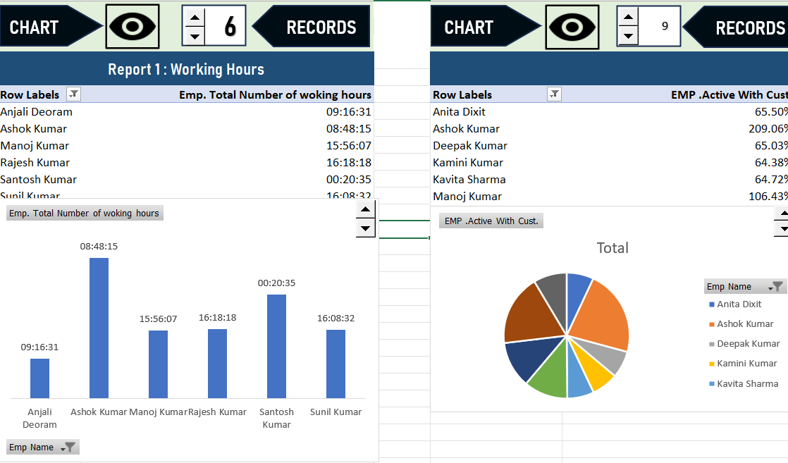

# 📊 Call Center Performance Dashboard (Excel)

## 📌 Project Overview
This project is an Excel-based Call Center Dashboard created to analyze employee
performance using real-world metrics like working hours, breaks, efficiency,
and customer engagement.

The dashboard is built using a summary sheet as the base and visualized
through charts and pivot tables.

---
## 📸 Dashboard Preview
The dashboard below highlights employee working hours,
customer engagement percentage, and overall performance metrics.

---

## 🧩 Key Features
- 📈 Employee Working Hours Analysis
- ☎️ Attended Calls Tracking
- ⏱ Total Break Time Monitoring
- 🎯 Active Time with Customers (%)
- 📊 Interactive Dashboard with Charts & Filters

---

## 🛠 Tools & Techniques Used
- Microsoft Excel
- Pivot Tables & Pivot Charts
- Data Cleaning & Formatting
- Summary Sheet Based Calculations
- Slicers & Filters for interactivity

---

## 📂 Sheets Included
- **Dashboard** – Visual representation of performance
- **Summaries** – Calculated KPIs and metrics
- **Efficiency** – Work efficiency data
- **Break** – Break time analysis
- **Overall Performance** – Employee-wise performance metrics

---

## 🎯 Use Case
This dashboard helps supervisors and managers:
- Monitor employee productivity
- Identify high & low performers
- Improve workforce efficiency
- Make data-driven decisions

---

## 👩‍💻 Created By
Khushi  
Aspiring Data Analyst  
Skills: Excel | SQL | Power BI | Python
